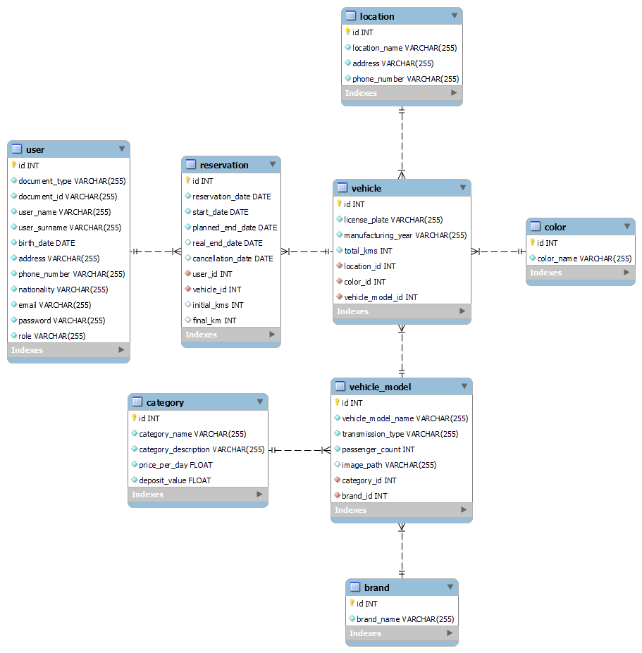

# TP-3k02-Berli-Gilardoni-Godoy-Jaca-Marquez-App

# Propuesta TP DSW

## Grupo

### Integrantes

- 50310 - Berli, Nahuel
- 51189 - Gilardoni, Lucio
- 51192 - Godoy, Marcos
- 50311 - Jaca, Juan Pablo
- 51419 - Márquez, Matías

### Repositorio

- [frontend|backend app](https://github.com/DSW-3k02-GGJM/TP-3k02-Berli-Gilardoni-Godoy-Jaca-Marquez-App)

## Tema

### Descripción

La aplicación a desarrollar pertenece a una empresa que se dedica a el alquiler de vehiculos. La empresa en cuestión es propietaria de una serie de vehiculos con distintas características que pone a disposición de clientes externos.

### Modelo

## Alcance Funcional

### Alcance Mínimo

Regularidad:
|Req|Detalle|
|:-|:-|
|CRUD simple|1. CRUD Cliente 2. CRUD Categoria 3. CRUD Marca 4. CRUD Color 5. CRUD Sucursal|
|CRUD dependiente|1. CRUD Vehiculo {depende de} CRUD Sucursal, Color y Modelo 2. CRUD Alquiler {depende de} CRUD Vehiculo y Cliente 3. CRUD Modelo {depende de} CRUD Categoria y Marca|
|Listado + detalle| 1. Listado de alquileres filtrado por fecha   2. Listado de vehiculos disponibles filtrado por rango de fechas solicitado para un alquiler   3. Listado de clientes|
|CUU/Epic|1. Reservar un vehiculo  2. Realizar el check-in de un alquiler  3. Realizar el check-out de un alquiler|

Adicionales para Aprobación
|Req|Detalle|
|:-|:-|
|CRUD |Todos los del MD|
|CUU/Epic|1. Reservar un vehiculo  2. Realizar el check-in de un alquiler  3. Realizar el check-out de un alquiler  4. Cancelar alquiler  5. Envio de recordatorio de alquiler 6. Comunicacion con clientes via mail.|
