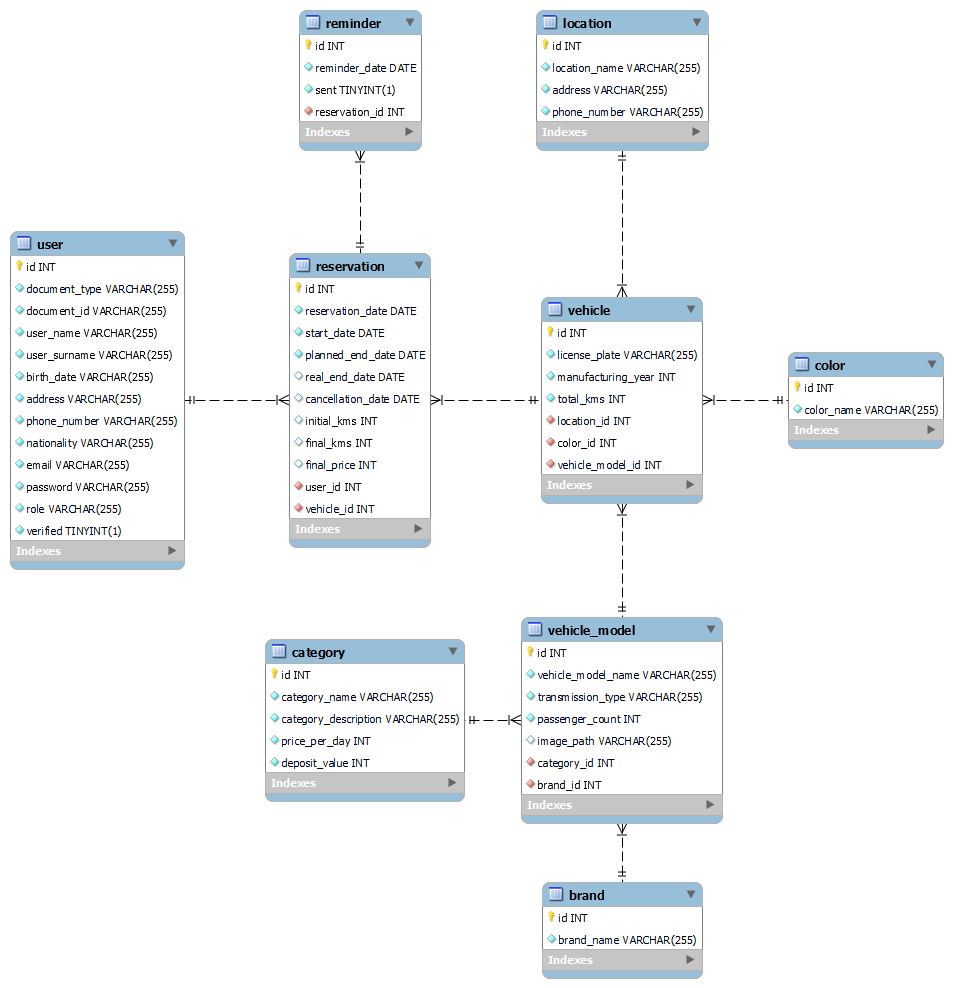

# TP-3k02-Berli-Gilardoni-Godoy-Jaca-Marquez-App

## Grupo

### Integrantes

- 50310 - Berli, Nahuel
- 51189 - Gilardoni, Lucio
- 51192 - Godoy, Marcos
- 50311 - Jaca, Juan Pablo
- 51419 - Márquez, Matías

## Video de las principales funcionalidades de la aplicación

- [Video de demostración](https://drive.google.com/file/d/1scrp8AMluKXIfDH-DRuDaw3F2Sh5x_VA/view)

## Pull Request Pedido

- [Pull request](https://github.com/DSW-3k02-GGJM/TP-3k02-Berli-Gilardoni-Godoy-Jaca-Marquez-App/pull/10)

## Tema

### Descripción

Esta aplicación pertenece a una empresa que se dedica al alquiler de vehículos. La empresa en cuestión es propietaria de una serie de vehículos con distintas características que pone a disposición de clientes externos.

### Modelo de Datos



## Instrucciones de Instalación y Ejecución del Proyecto

Para iniciar la aplicación, sigue estos pasos:

1. **Cloná el repositorio:**

```bash
git clone https://github.com/DSW-3k02-GGJM/TP-3k02-Berli-Gilardoni-Godoy-Jaca-Marquez-App.git
```

2. **Navegá hacia el backend (Desde la raíz del proyecto):**

```bash
cd backend
```

3. **Llevá a cabo cada uno de los pasos que se enumeran en 'backend/README.md'.**

4. **Navegá hacia el frontend (Desde la raíz del proyecto):**

```bash
cd frontend
```

5. **Completá cada uno de los pasos que se indican en 'frontend/README.md'.**

---

### Opcional

**Importá datos pre-cargados desde el siguiente archivo .mysql, para facilitar la prueba de la aplicación:**

- [Base de Datos](https://drive.google.com/file/d/1yTwhIJxGQsc-7Be9Q_Hmqmft0WOD2jTH/view?usp=sharing)

> ⚠️ **Nota:** Deberás modificar las imágenes de los modelos de los vehículos para que las mismas puedan visualizarse correctamente al momento de realizar una reserva, dado que las rutas almacenadas en estos datos de prueba corresponden a imagenes que no se encontrarán disponibles si no fueron agregadas a través del uso de nuestra aplicación.

---

## Alcance Funcional

### Alcance Mínimo

Regularidad:
|Req|Detalle|
|:-|:-|
|CRUD simple|1. CRUD Categoría<br>2. CRUD Color<br>3. CRUD Marca<br>4. CRUD Sucursal<br>5. CRUD Usuario|
|CRUD dependiente|1. CRUD Modelo {depende de} CRUD Categoría y Marca<br>2. CRUD Reserva {depende de} CRUD Vehículo y Usuario<br>3.CRUD Vehículo {depende de} CRUD Color, Modelo y Sucursal|
|Listado<br>+<br>detalle|1. Listado de reservas filtrado por fecha<br>2. Listado de vehículos disponibles filtrado por rango de fechas solicitado para una reserva<br>3. Listado de clientes|
|CUU/Epic|1. Reservar un vehículo<br>2. Realizar el check-in de una reserva<br>3. Realizar el check-out de una reserva|

Adicionales para Aprobación
|Req|Detalle|
|:-|:-|
|CRUD |Todos los del MD|
|CUU/Epic|1. Reservar un vehículo<br>2. Realizar el check-in de una reserva<br>3. Realizar el check-out de una reserva<br>4. Cancelar reserva<br>5. Enviar recordatorios de reserva a los clientes<br>6. Comunicarse con clientes mediante correo electrónico.|
