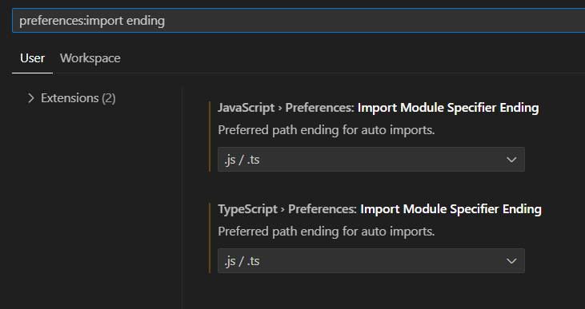
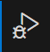
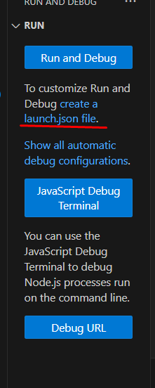
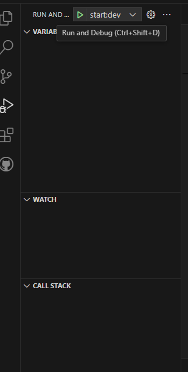

# TP-3k02-Berli-Gilardoni-Godoy-Jaca-Marquez-BE-App

## Instalación de dependencias

1. Dentro de la carpeta 'backend', ejecutar el siguiente comando en consola:

```bash
   npm install
```

2. Configurar VSCode con estas settings:

'preferences:import ending'



## Pasos previos a la compilación y ejecución

1. Dirigirse a "backend/src/shared/db/orm.ts" y adaptar el clientUrl con los datos propios de tu conexión local.

2. Según lo especificado en el paso anterior, crear una Base de Datos local con el nombre "alquilerVehiculos".

## Compilación y ejecución de la app (sin configuración)

### Compilación

1. Desde la carpeta 'backend', abrir una consola.

2. Ejecutar el siguiente comando:

```bash
   pnpm run build
```

### Ejecución

1. Desde la carpeta 'backend', abrir una consola.

2. Ejecutar el siguiente comando:

```bash
   pnpm run start:dev
```

### Ejecución (con configuración)

Si se quiere configurar el VSCode para ejecutar con botones, seguir los siguientes pasos:

1. Ir a 'Run and debug'



2. Crear un archivo launch.json



3. Borrar todo y pegar esto en dicho archivo:

```json
{
    "version": "0.2.0",
    "configurations": [
      {
        "name": "buildBackEnd",
        "request": "launch",
        "cwd": "${workspaceFolder}/backend",
        "runtimeArgs": ["build"],
        "runtimeExecutable": "pnpm",
        "skipFiles": ["<node_internals>/**"],
        "type": "node",
      },
      {
        "name": "startBackEnd:dev",
        "request": "launch",
        "cwd": "${workspaceFolder}/backend",
        "runtimeArgs": ["start:dev"],
        "runtimeExecutable": "pnpm",
        "skipFiles": ["<node_internals>/**"],
        "type": "node",
      }
    ]
}
```

4. Ahora, ya deberían estar los botones para ejecutar la app localmente.


