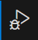
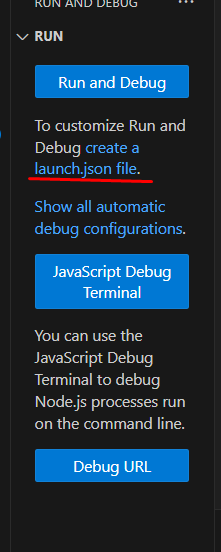
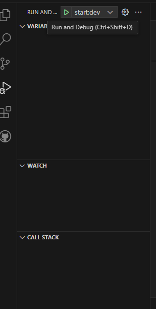

# TP-3k02-Berli-Gilardoni-Godoy-Jaca-Marquez-BE-App

## Instalación de dependencias
Parandose en la carpeta 'backend' escribimos los siguientes comandos en consola:

1. Dependencias de TypeScript:

* O con npm
```bash
   npm install --save-dev typescript@5.1.3
   npm install --save-dev tsc-watch@6.0.4
```
* Con pnpm
```bash
   pnpm add -D typescript@5.1.3
   pnpm add -D tsc-watch@6.0.4
```
2. Configuramos vscode con estas settings:
'preferences:import ending'


3. Dependencias de Express:
* Con pnpm
```bash
   pnpm add -E express
   pnpm add -E -D typescript tsc-watch @types/express @types/node
```

## Compilación y ejecución de la app (sin configuración)
### Compilación
1. Desde la carpeta 'backend' abrir una consola.

2. Escribir y ejecutar el comando: 

* Con npm
```bash
   npm run build
```
* O con pnpm
```bash
   pnpm init
```

### Ejecución
1. Desde la carpeta 'backend' abrir una consola.

2. Escribir y ejecutar el comando: 

* Con npm
```bash
   npm run start:dev
```
* O con pnpm
```bash
   pnpm add -D typescript@5.1.3
   pnpm add -D tsc-watch@6.0.4
```

### Ejecución con configuración
Si querés configurar el vscode para ejecutar con botones seguí los siguientes pasos:

1. Ir a 'Run and debug'


2. Crear un arcfhivo launch.json


3. Borrar todo y pegar esto en dicho archivo:
```json
{
      // Use IntelliSense to learn about possible attributes.
      // Hover to view descriptions of existing attributes.
      // For more information, visit: https://go.microsoft.com/fwlink/?linkid=830387
      "version": "0.2.0",
      "configurations": [
         {
         "name": "build",
         "request": "launch",
         "runtimeArgs": ["build"],
         "runtimeExecutable": "pnpm",
         "skipFiles": ["<node_internals>/**"],
         "type": "node"
         },
         {
         "name": "start:dev",
         "request": "launch",
         "runtimeArgs": ["start:dev"],
         "runtimeExecutable": "pnpm",
         "skipFiles": ["<node_internals>/**"],
         "type": "node"
         }
      ]
   }
```
4. Ya deberían estar los botones para ejecutar la app localmente.
