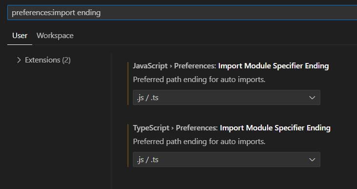

# TP-3k02-Berli-Gilardoni-Godoy-Jaca-Marquez-BE-App

## Instalación de dependencias

1. Ejecutá el siguiente comando en consola:

```bash
   npm install
```

2. Configurá VSCode con estas settings:



## Pasos previos a la compilación y ejecución

1. Creá un archivo .env que siga la forma de 'backend/.env.example', en la misma ubicación que dicho archivo, y completá la información correspondiente.

2. Creá una Base de Datos MySQL Local cuya información coincida con lo especificado en el MYSQL_CONNECTION del archivo 'backend/.env' recientemente creado.

## Compilación y ejecución de la aplicación

### Compilación

1. Ejecutá el siguiente comando en consola:

```bash
   pnpm run build
```

### Ejecución

1. Ejecutá el siguiente comando en consola:

```bash
   pnpm run start:dev
```
