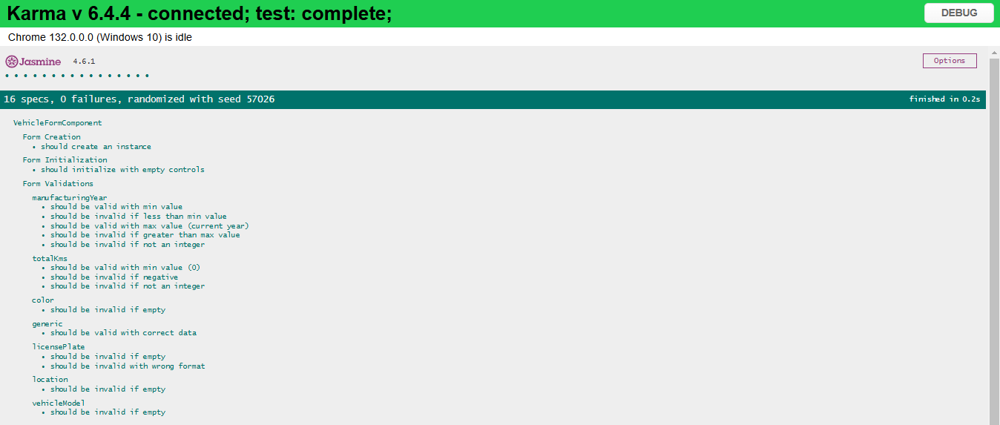
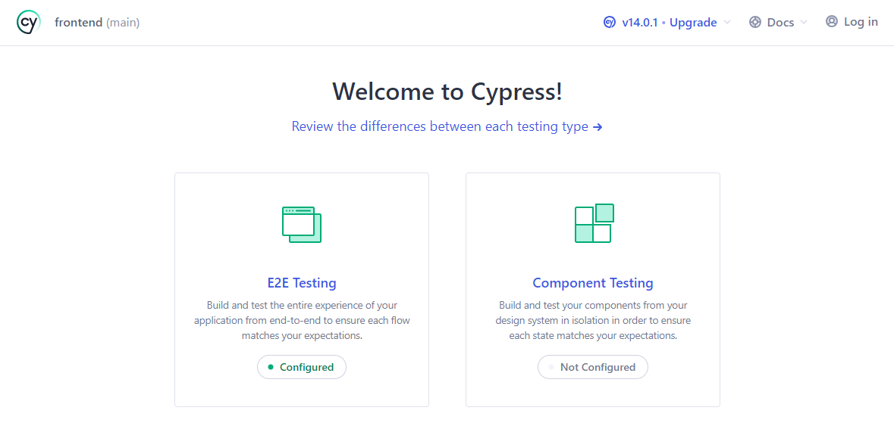
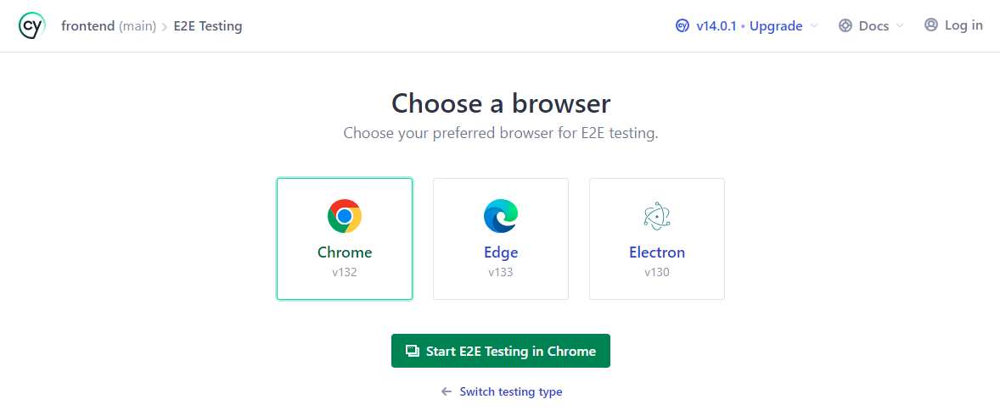
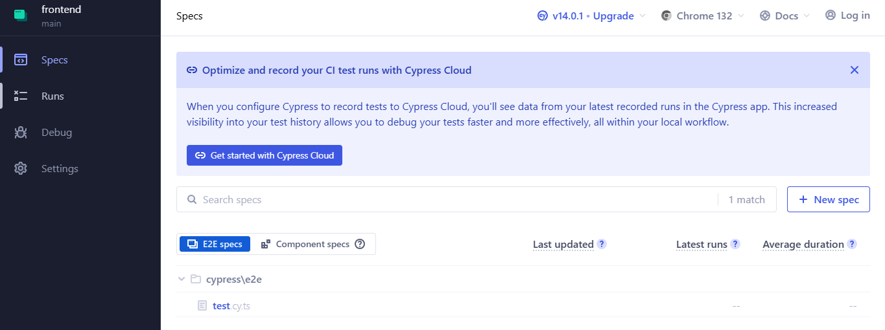
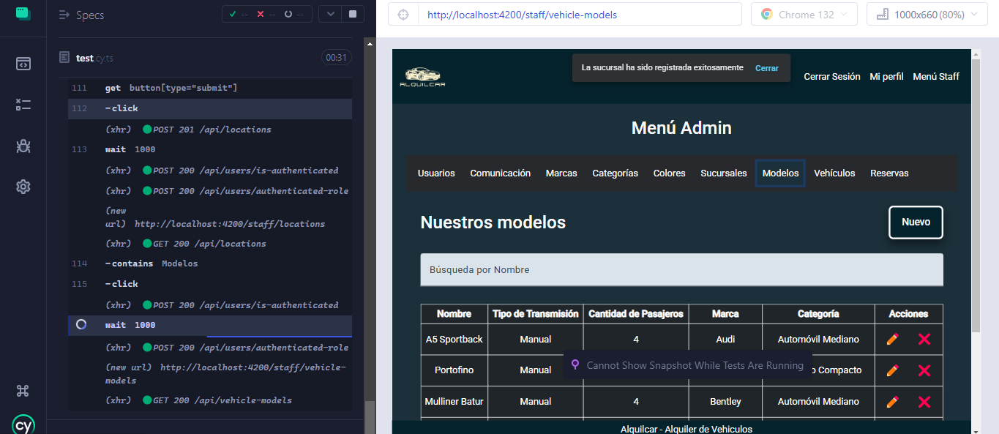
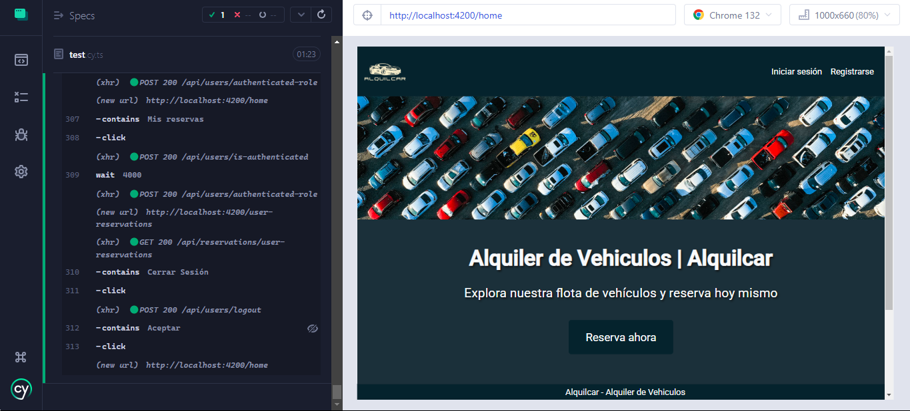
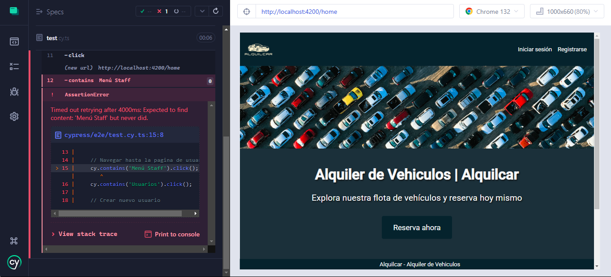
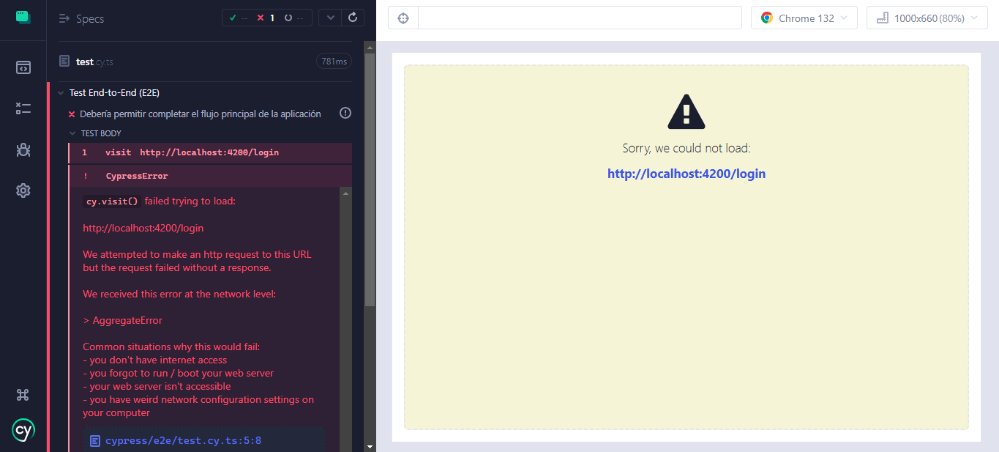
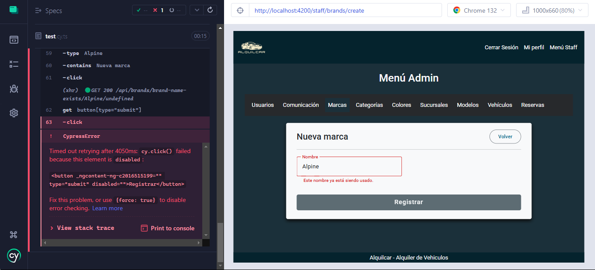

# Instrucciones de Ejecución de Tests Automáticos

Antes de proceder con los pasos a seguir para poder ejecutar los tests, es apropiado mencionar las tecnologías con las que los desarrollamos:

- **BACKEND**:

  - **JEST** + **SUPERTEST**

- **FRONTEND**:

  - Test Unitario de un Componente:

    - **JASMINE** + **KARMA**

  - Test End-to-End (E2E):

    - **CYPRESS**

Ahora sí, para ejecutar los tests automáticos en nuestra aplicación, seguí las instrucciones que se indican a continuación:

- ### BACKEND

  - Antes de empezar, asegurate de haber completado con éxito cada uno de los pasos que se indicaron en las **[instrucciones de instalación del backend](../../backend/README.md)**, en especial los relacionados a la creación de una base de datos adicional para testing.

    > ⚠️ **Nota:** Es muy importante que en tu variable de entorno **MYSQL_CONNECTION_TEST** esté asignado el String de Conexión a dicha base de datos para pruebas.

  1. Asignale el valor `test` a la variable de entorno `NODE_ENV` en tu archivo `.env`.

     Debería quedar así:

     ```
     NODE_ENV = test
     ```

  2. Si todavía no estás ahí, navegá hacia el backend del proyecto en tu consola:

     ```
     cd backend
     ```

     Este comando es un ejemplo de lo que deberías ejecutar si te encontrás en la raíz del proyecto. Adaptalo si es necesario.

  3. Una vez que te hayas asegurado de asignarle a tus variables de entorno `NODE_ENV` y `MYSQL_CONNECTION_TEST` los valores indicados, ejecutá el siguiente comando en tu consola:

     ```
     npm test
     ```

     ✅ **Éxito en la ejecución de los tests**

     - Si todo ocurre según lo esperado, deberías ver un log en tu consola en el que se te muestre cada uno de los tests ejecutados, donde cada uno prueba algún endpoint disponible en nuestra API de backend, comprobando así su correcto funcionamiento.

       Por ejemplo:

       ```
       Brand Endpoints
         √ should create a new brand with correct payload (POST) (52 ms)
       ```

       Para cada uno de los tests ejecutados, se mostrará su descripción y un ícono al principio que hará referencia a su resultado.

     - Además, deberías poder observar también un resumen de cobertura que te indique mediante porcentajes, qué parte de nuestro backend fue testeado.

       Se vería algo como:

       ```
       -------------------------------|---------|----------|---------|---------|--------------------------------
       File                           | % Stmts | % Branch | % Funcs | % Lines | Uncovered Line #s
       -------------------------------|---------|----------|---------|---------|--------------------------------
       All files                      |   82.08 |    69.64 |    82.4 |   81.87 |
        src/core/brand                |   92.42 |      100 |     100 |   92.06 |
         brand.controller.ts          |   90.19 |      100 |     100 |   90.19 | 20,36,48,66,8 9
         brand.entity.ts              |     100 |      100 |     100 |     100 |
         brand.middleware.ts          |     100 |      100 |     100 |     100 |
         brand.routes.ts              |     100 |      100 |     100 |     100 |
       ```

       Esto es un corto ejemplo, deberías ver un resumen bastante más largo.

     - Por último, deberías poder visualizar una serie de datos que describen, entre otras cosas, la cantidad de tests ejecutados, su resultado (éxito o fallo), y el tiempo que demoró la ejecución completa de todos los tests.

       Un ejemplo de lo que podrías ver sería:

       ```
       Test Suites: 1 passed, 1 total
       Tests:       145 passed, 145 total
       Snapshots:   0 total
       Time:        22.95 s, estimated 34 s
       ```

- ### FRONTEND

  - #### Test Unitario de un Componente:

    - Para este test, no es necesario tener en ejecución ni el frontend ni el backend, dado que el mismo se enfoca en comprobar el funcionamiento interno del componente en cuestión.

    - Elegimos testear el funcionamiento del componente VehicleFormComponent, que es aquel mediante el cual se pueden tanto registrar nuevos vehículos, como editar existentes.

    1. Si todavía no estás ahí, navegá hacia el frontend del proyecto en tu consola:

       ```
       cd frontend
       ```

       Este comando es un ejemplo de lo que deberías ejecutar si te encontrás en la raíz del proyecto. Adaptalo si es necesario.

    2. Ejecuta el siguiente comando en tu consola:

       ```
       npm run test:ut
       ```

       ✅ **Éxito en la ejecución del test**

       - Si todo ocurre según lo esperado, se debería abrir una ventana de Google Chrome, en la que puedas ver el resultado de la ejecución del test, como la siguiente:

       

       El orden de ejecución de estos tests unitarios es aleatorio, por lo que lo que veas en tu navegador puede no coincidir exactamente con la imagen de arriba. A pesar de eso, deberías poder visualizar en tu navegador todos los tests que se muestran en la imagen.

  - #### Test End-to-End (E2E):

    - Para el correcto funcionamiento de este test, es necesario tener en ejecución tanto el frontend como el backend.

      > ⚠️ **Nota:** El backend debe ejecutarse en modo `development`, con el objetivo de no afectar el funcionamiento de los tests de la API, que se ejecutan en modo `test`, con una base de datos adicional.

    - Asegurate de ejecutar el backend como se mencionó en la sección de ejecución en las **[instrucciones de instalación](../../backend/README.md)**.

      Como ayuda, te dejamos el comando directamente acá:

      ```
      npm start
      ```

      Tené en cuenta que debés encontrarte dentro del directorio del backend cuando lo ejecutes.

    - Lo mismo sucede con el frontend, así que asegurate de ejecutarlo como se mencionó en las **[instrucciones de instalación](../../frontend/README.md)**.

      Como ayuda, te dejamos el comando directamente acá:

      ```
      npm start
      ```

      Tené en cuenta que debés encontrarte dentro del directorio del frontend cuando lo ejecutes.

    1. Desde otra consola, navegá hacia el frontend:

       ```
       cd frontend
       ```

       Este comando es un ejemplo de lo que deberías ejecutar si te encontrás en la raíz del proyecto. Adaptalo si es necesario.

    2. Ejecuta el siguiente comando en tu consola:

       ```
       npm run test:e2e
       ```

    3. Esperá que se abra una ventana de Google Chrome.

       Una vez que lo haga y cargue, deberías poder visualizar lo siguiente:

       

    4. Hacé click en el recuadro que tiene como título `E2E Testing`.

       Ahora, deberías ver lo siguiente:

       

    5. Aunque debería funcionar en cualquiera de los navegadores que ofrece Cypress, al haberlo testeado nosotros desde Google Chrome, te recomendamos que hagas lo mismo.

       Por lo tanto, hacé click en el recuadro de `Chrome`, y luego en el de `Start E2E Testing in Chrome`.

       Se debería abrir otra ventana del navegador, que muestre lo siguiente:

       

    6. Hacé click en el archivo que dice `test.cy.ts`.

       Deberías visualizar ahora una pantalla en la que se muestre a la derecha la interfaz frontend de nuestro proyecto, y a la izquierda los comandos, sentencias y solicitudes HTTP que realiza el Test End-to-End (E2E) en tiempo real.

       La pantalla se debería parecer a la siguiente:

       

       ✅ **Éxito en la ejecución del test**

       - Si todo ocurre según lo esperado, el test debería realizar, a lo largo de su ejecución (que podrás ver gráficamente en la interfaz en tiempo real), lo siguiente:

         1. Iniciar sesión como administrador.

         2. Navegar al 'Menú Staff'.

         3. Registrar:

            i. un nuevo usuario con el rol 'Cliente'.

            ii. una nueva marca.

            iii. una nueva categoría.

            iv. un nuevo color.

            v. una nueva sucursal.

            vi. un nueva modelo.

            vii. un nuevo vehículo.

         4. Realizar como administrador una reserva del nuevo vehículo para el nuevo cliente, con una duración de 1 día, empezando en la fecha actual.

         5. Realizar el check-in de la reserva.

         6. Realizar el check-out de la reserva, indicando los kilómetros actuales del vehículo utilizado, y asegurando que se le debe devolver el depósito en garantía al cliente.

         7. Cerrar sesión.

         8. Iniciar sesión desde la cuenta del nuevo cliente.

         9. Navegar mediante el botón 'Reserva ahora' hacia la página que le permita realizar una reserva siendo cliente.

         10. Realizar una reserva con una duración de 1 día para el mes próximo, seleccionando el mismo vehículo de la reserva que realizó previamente el administrador.

         11. Visualizar las dos reservas pertenecientes al cliente presionando en 'Mis reservas' (la que realizó el administrador y la del paso anterior).

         12. Cerrar sesión.

       - Finalmente, deberías ver lo siguiente cuando el test termine de ejecutarse:

       

       ❌ **Fallo en la ejecución del test**

       - Hay tres razones principales por las que el test podría fallar:

         1. El backend no se encuentra en ejecución.

         En este caso, al querer iniciar sesión como administrador, le dará un error, y cuando intente dirigirse al 'Menú Staff' no encontrará el botón para hacerlo.

         Por lo tanto, verás algo como:

         

         🔹 **Solución:** Asegurate de que el backend esté ejecutándose y de que la base de datos esté disponible.

         2. El frontend no se encuentra en ejecución.

         En este caso, no podrá acceder a la interfaz, y verás algo como esto:

         

         🔹 **Solución:** Verificá que el frontend esté ejecutándose.

         3. En tu base de datos ya existen entidades con valores que deben ser únicos y que se utilizan en este test. En ese caso, las validaciones asíncronas en los formularios detectarán el conflicto y no permitirán que el test continúe.

            **Ejemplo:** Si ya existe una marca con el nombre "_Alpine_", el test no podrá crear otra con el mismo nombre.

         Verás algo como:

         

         🔹 **Solución:** Eliminá los registros con valores duplicados manualmente en tu base de datos.
