# Evidencia de Ejecución de Tests Automáticos

A continuación, se presenta la evidencia de ejecución de los tests automáticos:

- **BACKEND**:

  - #### 🧪 Tests Ejecutados:

    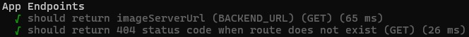

    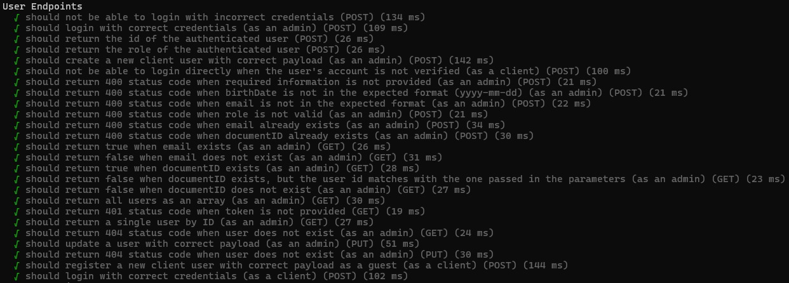

    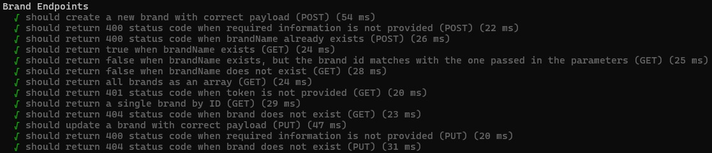

    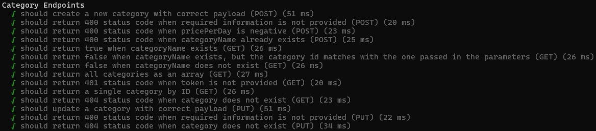

    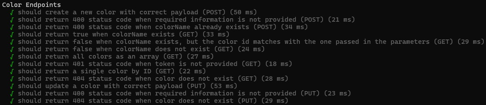

    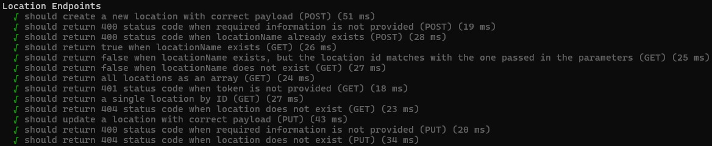

    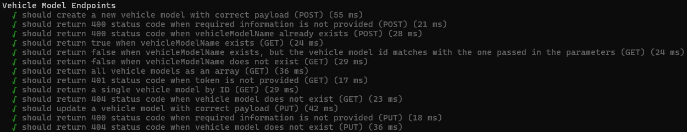

    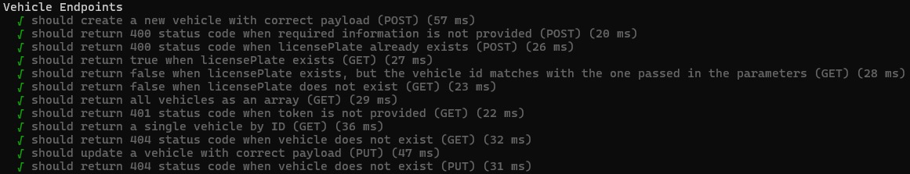

    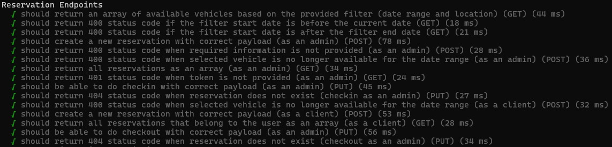

    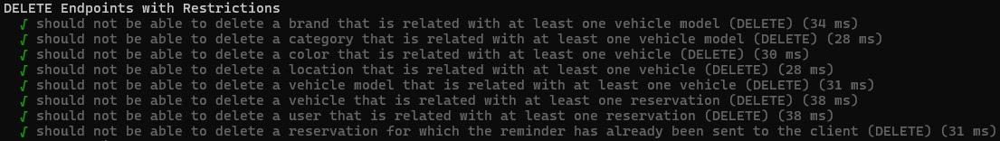

    

    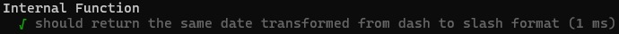

  - #### 📊 Resultado de la Ejecución:

    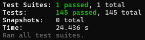

  - #### 📊 Reportes de Cobertura:

    - En consola:

      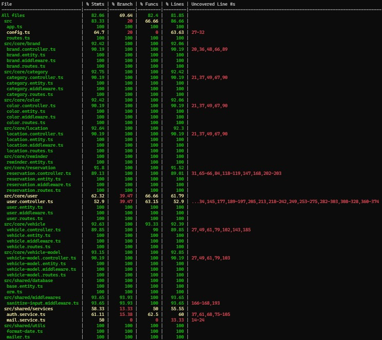

    - HTML generado:

      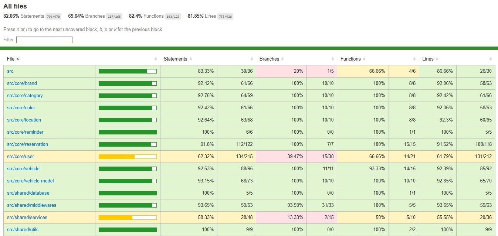

      > 💡 **Sugerencia:** Si querés visualizar este reporte de cobertura en formato HTML al ejecutar los tests siguiendo las **[instrucciones](./instructions/tests.md)**, deberías encontrarlo en `./backend/coverage/lcov-report/index.html`.

- **FRONTEND**:

  - 🔬 **Test Unitario de un Componente**:

    - **Evidencia de Ejecución**:

      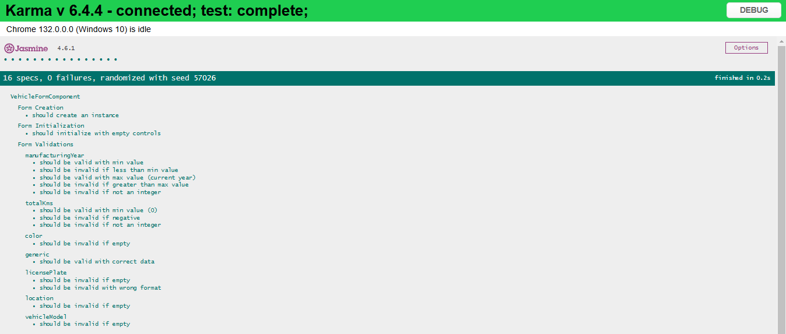

  - 🚀 **Test End-to-End (E2E)**:

    - **Evidencia de Ejecución**:

      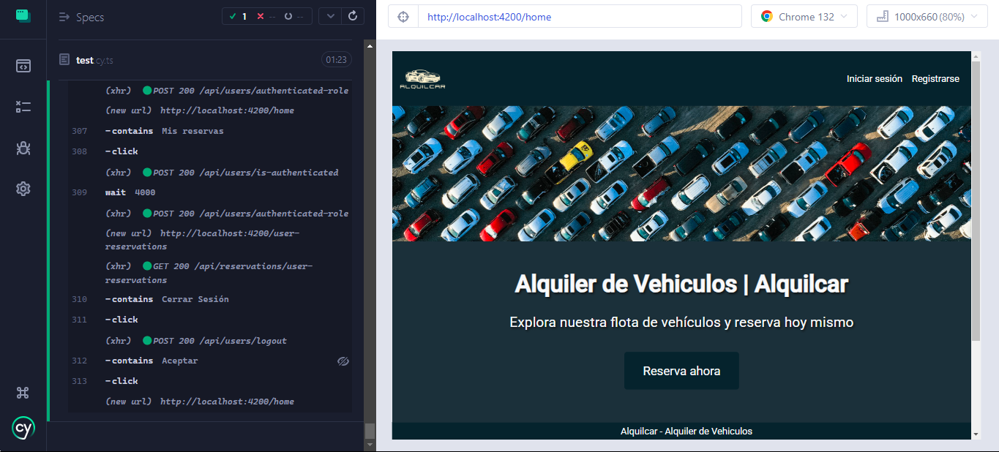
